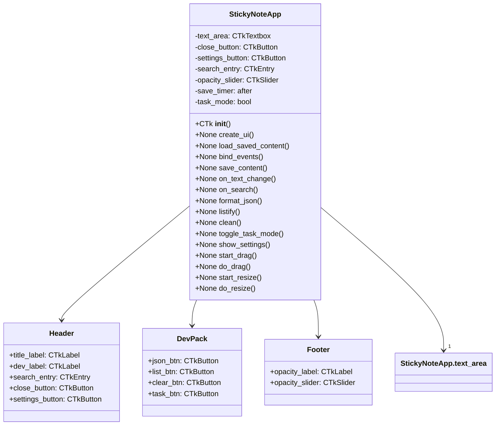
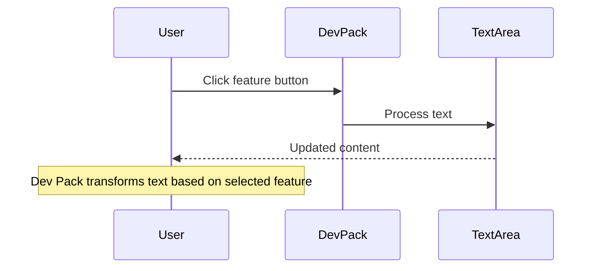

# FluentNote - Sticky Note Application

A modern, feature-rich sticky note application built with Python and CustomTkinter.

---

## Quick Start

```bash
# Install dependencies
pip install -r requirements.txt

# Run the app
python main.py
```

---

## Features

### Core Features
- **Borderless/Transparent Window** - 90% opacity with dark theme
- **Always-on-Top** - Stays above other windows
- **Draggable Window** - Click anywhere on the window to move it
- **Resizable** - Use the resize grip in bottom-right corner
- **Opacity Slider** - Adjust transparency (50%-100%) in the footer
- **Auto-Save** - Saves content automatically with 500ms debounce to `sticky_note.txt`

### Dev Pack Features
| Feature | Description |
|---------|-------------|
| **JSON** | Pretty-prints valid JSON content |
| **List** | Prefixes each line with `- ` for task lists |
| **Clear** | Clears all text (with confirmation dialog) |
| **Tasks** | Toggle checkbox mode - click to mark tasks complete |

### Additional Features
- **Search** - Highlight matching text in real-time
- **Auto-Copy Selection** - Selected text automatically copied to clipboard
- **Launch on Startup** - Option to start with Windows (via Settings ⚙)

### Keyboard Shortcuts
| Shortcut | Action |
|----------|--------|
| `Ctrl+A` | Select all text |
| `Ctrl+Z` | Undo |
| `Ctrl+Y` | Redo |

---

## User Guide

### For Non-Technical Users

#### Transparency
The app has a slider at the bottom labeled with `α` (alpha). Drag it left to make the window more see-through (down to 50%) or right to make it more solid (up to 100%). Your preference is saved automatically when you close the app.

#### Dev Pack (Left Sidebar)
The sidebar on the left contains utility buttons:
- **JSON** - If you paste JSON text, click this to format it nicely with indentation
- **List** - Converts your text into a list format with dashes
- **Tasks** - Turns lines starting with `-` into clickable checkboxes. Click a checkbox to mark it done
- **Clear** - Removes all text (asks for confirmation first)

#### Moving the Window
Click anywhere on the app (except inside the text area) and drag to move it around your screen.

#### Resizing
Click and drag the `⋰⋰` symbol in the bottom-right corner to resize the window.

---

## Architecture

### Class Diagram



### Auto-Save Sequence

```mermaid
sequenceDiagram
    participant User
    participant TextArea
    participant App
    participant FileSystem

    User->>TextArea: Types text
    TextArea->>App: <<Modified>> event
    App->>App: on_text_change()
    Note right of App: Cancel existing timer<br/>Start new 500ms timer
    App->>App: save_content() after 500ms
    
    rect rgb(40, 40, 40)
        Note over App,FileSystem: Debounce Period (500ms)
    end
    
    App->>FileSystem: Write to sticky_note.txt
    FileSystem-->>App: Success
    
    Note over User: Auto-save complete!
```



### Dev Pack Feature Flow



---

## Settings

Access via the ⚙ button in the header:
- **Launch on Startup** - Toggle to start FluentNote when Windows boots

---

## Build from Source

### Using PyInstaller

```bash
# Install pyinstaller
pip install pyinstaller

# Build single executable
pyinstaller --onefile --name FluentNote --icon=app_icon.ico main.py
```

The executable will be in the `dist` folder.

---

## License

MIT License - See LICENSE file

---

## Credits

Developed by Ali Hasan